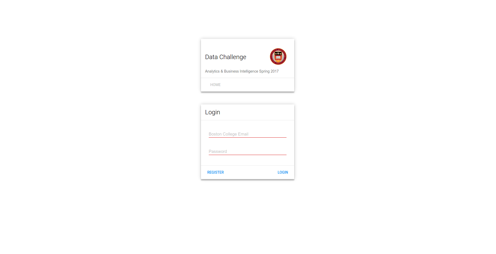
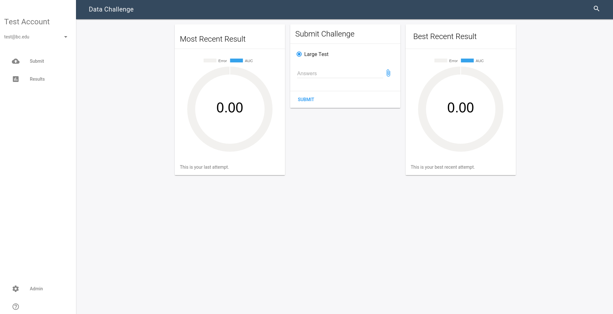
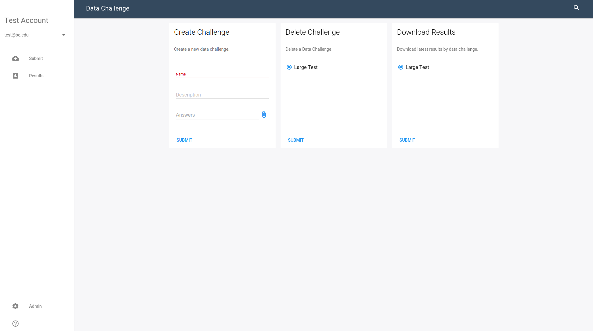

# Data Challenge

A simple login site to score the accuracy of predictive models.

## Installation

1. Install Apache2, PHP, MySQL
2. Clone Repo into document root: ``git clone https://github.com/nickmitchko/data-challenge /var/www/``
3. Create tables in [Scripts/](Scripts/) directory
4. Change database credentials in the [credentials file](App/Database/Credentials.php)

## Usage

1. Create accounts on the Register.php page
2. Add your account to the Administration table created (see [Administration.sql](Scripts/Administration.sql))
3. Navigate to ``Home=>Admin`` to upload a challenge
4. Navigate to ``Home=>Submit`` to submit a challenge

## Screenshots

#### Login

#### Home

#### Submitted Model

#### Administration

